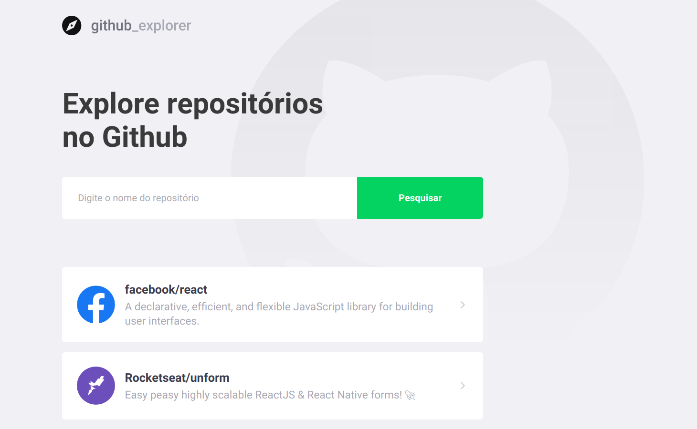
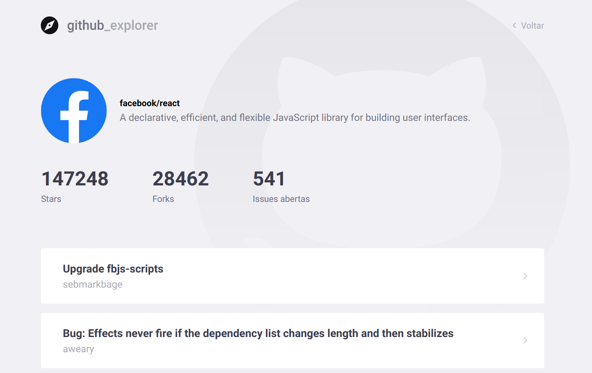

<h1 align="center">
 
  
 
 
Github Explorer
</h1>

An application to view Github repositories and their starts, forks and issues

  
  

 
  

## Features

This app features all the latest tools and practices in web development!

- **React** — A library to build user interfaces
- **CSS** — styled-components
- **Lint** — ESlint/Prettier/Editor Config
- **Axios** — A library to make HTTP requests

## Getting started
1. Clone this repo using `https://github.com/pjavier98/github_explorer.git`
2. Move to the appropriate directory: `cd github_explorer`. 
3. Run `yarn` to install dependencies. 
4. Run `yarn start` to see the example app at `http://localhost:3000`.

## Contributing

Please read [CONTRIBUTING.md](CONTRIBUTING.md) for details on our code of conduct, and the process for submitting pull requests.

## License

This project is licensed under the MIT License - see the [LICENSE.md](LICENSE.md) file for details.
